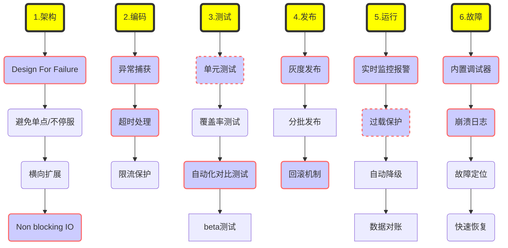

----

#### 0x00 高可用系统建设

1. 当一个系统面临持续的大流量时，它其实很难单靠自身调整来恢复状态，你必须等待流量自然下降或者人为地把流量切走才行。
2. 我们可以在系统达到不可用状态之前就做好流量限制，防止最坏情况的发生。用现在流行的话来说，任何一个系统，都需要“**反脆弱**”。

---

#### 0x01 架构阶段

架构阶段主要考虑系统的可扩展性和容错性，要**避免系统出现单点问题**。例如多机房单元化部署，即使某个城市的某个机房出现整体故障，仍然不会影响整体网站的运转。

----

#### 0x02 编码阶段

编码最重要的是保证代码的健壮性。

##### 异常捕获

对函数调用的结果集要有预期，防止返回的结果超出程序处理范围，，最常见的做法就是对错误异常进行捕获，对无法预料的错误要有默认处理结果。

##### 异步IO

更准确地说应该是**异步线程**，指所有耗时的操作/调用都应该放到单独的线程中处理，以防止由于处理时间过长导致服务线程阻塞。

耗时操作通常有两种：一种是CPU密集型，就是要做的事情真的很多，如果没有其它CPU帮忙的话，能把一颗CPU累死；另一种是IO密集性，就是虽然没CPU啥事儿，但是如果非要让它等到IO完成的话，能等到花儿都谢了，常见的耗时IO操作包括MySQL, Redis, Socket等。

而我们的IO问题似乎更加严重一些。

目前代码中常见的是**缓存失效方案**：也就是我在内存中保留一段数据的缓存，设定一个失效时间，在缓存失效前一直使用缓存中的数据，在缓存失效后才启动一次IO查询更新数据。这个方案减少了IO次数，并且能够在一定程度上保证内存中的数据虽然不是最新，但不会延期太旧。但这个方案有两个问题：

1. 问题一：缓存失效后，启动的那一次IO查询是在服务线程运行的，如果本次IO耗时较长的话，会导致**服务线程本次服务的响应时间变长**。从表现上来看，服务线程的响应时间会周期性振荡，你会发现每隔几秒中服务线程的响应时间就变长一次，有点儿像心电图的感觉。
2. 问题二：启动IO查询新数据是在缓存失效后进行的，这个先后顺序有问题：如果查询成功了还好，最多是本次服务的响应时间慢一点儿。如果查询失败了呢？缓存中的数据因为失效，可能已经被清空了，也就是说现在你手里没有任何数据展示给用户了，换句话说，**服务不可用了**。

有两个方案改进这两个问题：

1. 方案一：使用异步IO轮询数据
2. 方案二：使用发布订阅机制

##### 超时处理

例如涉及RPC调用问题时，要设置合理的超时退出机制，防止被其他系统拖垮。

----

#### 0x03 测试阶段

测试主要是保证测试用例的覆盖度，保证最坏情况发生时，我们也有相应的处理流程。

----

#### 0x04 发布阶段

发布时也有一些地方需要注意，因为发布时最容易出现错误，因此要有紧急的回滚机制。

----

#### 0x05 运行阶段

运行时是系统的常态，系统大部分时间都会处于运行态，运行态最重要的是对系统的监控要准确及时，发现问题能够准确报警并且报警数据要准确详细，以便于排查问题。

---

#### 0x06 故障发生

故障发生时首先最重要的就是**及时止损**，例如由于程序问题导致商品价格错误，那就要及时下架商品或者关闭购买链接，防止造成重大资产损失。然后就是要能够及时恢复服务，并定位原因解决问题。

----

#### Reference

1. [准备Plan B：如何设计兜底方案？--- 如何设计一个秒杀系统](https://blog.csdn.net/u014231523/article/details/83005971)
2. [A/B测试和灰度发布的关系](http://www.appadhoc.com/blog/ab-testing-and-grey-release/)
3. [百亿级微信红包的高并发资金交易系统设计方案](http://www.infoq.com/cn/articles/2017hongbao-weixin?utm_campaign=infoq_content&utm_source=infoq&utm_medium=feed&utm_term=global)