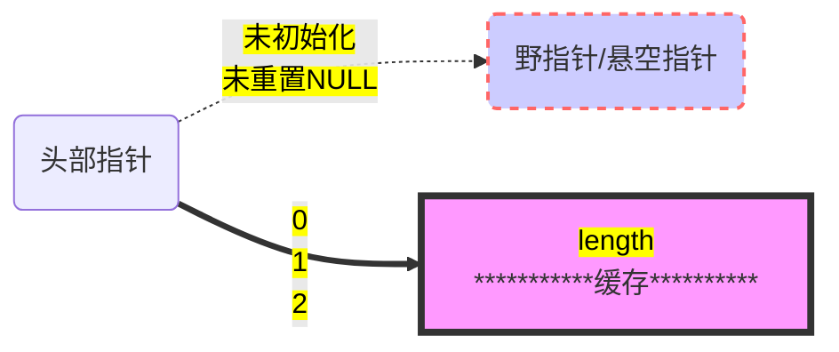

----

#### C++有六大内存问题

描述一个缓冲区需要两个属性：**头部指针（head pointer）和长度（length）**，这两个属性使用不好就会产生五个问题，如下图所示：

跟指针相关的有4个：

1. 指针指错了：
   - 未初始化的指针叫野指针（wild pointer）
   - 指向已释放对象的叫悬空指针（danling pointer）
2. 指针指对了但释放次数为0叫memory leak
3. 释放次数为1但不配对的叫“不配对的new[]/delete”
4. 释放次数为2的叫double delete

跟缓冲区的length相关只有一个：

1. 如果不使用length控制会产生缓存溢出（buffer overrun）

第六个内存问题是内存碎片，跟我们关系不大，忽略之。

