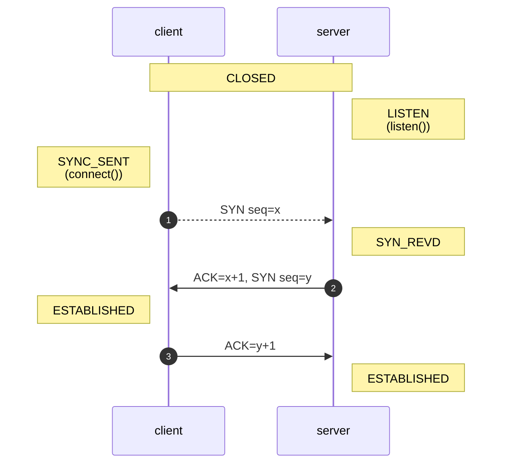
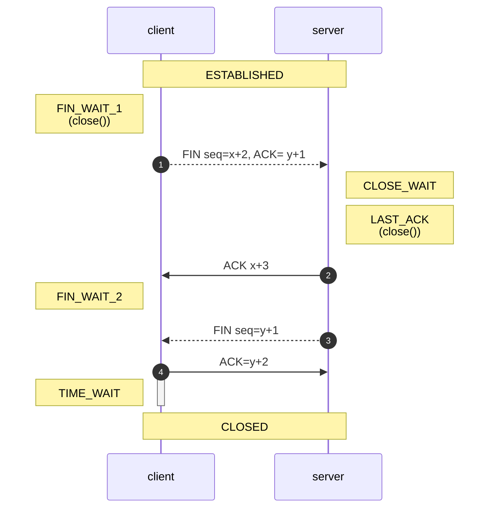

[toc]


----

#### 00 寄语

```shell

# 通过ip查域名
nslookup 10.20.30.40

```


-----

#### 01 netstat

linux下建议使用netstat命令


```shell
# 显示所有进程
netstat -tap

# 只显示listening的进程
netstat -ntlp

# 统计链接状态
netstat -na | awk '/^tcp/ {++S[$NF]} END {for(a in S) print a, S[a]}'
```


|      |                                                              |
| ---- | ------------------------------------------------------------ |
| -a   | all，显示listening和non-listening状态的sockets               |
| -e   | 显示扩展信息，例如uid                                        |
| -n   | number，把local address和foreign address都显示为ip和端口（如果需要**按端口过滤，则必选**） |
| -l   | listening，只显示listening状态的sockets                      |
| -p   | PID或Program Name，显示建立相关链接的程序名                  |
| -r   | route，显示路由信息                                          |
| -s   | state，按各个协议进行统计                                    |
| -t   | tcp，仅显示tcp相关选项                                       |
|      |                                                              |
|      |                                                              |


----

#### 02 lsof

1. mac下建议使用lsof命令
2. centos下查占用端口，特别好使 `lsof -i:8888`


|      |                                                        |
| ---- | ------------------------------------------------------ |
| -n   | 不显示主机名                                           |
| -i   | internet，-i4, -i6, -itcp, -i :port ，按给定的条件过滤 |
| -P   | 不显示端口俗称， *:mysql --> *:3306                    |
| -s   | state，按状态过滤                                      |
|      |                                                        |
| sudo | 如果不加，则只显示当前用户的，比如无法显示mysql的端口  |


```shell

# i一定要放到最后
sudo lsof -nP -i

# 打印listen的那h些进程
sudo lsof -nP -itcp -stcp:listen
sudo lsof -nP -i | grep -i listen	# 跟上面这一条结果一样
```


----

#### 03 mkcert

```shell
# 安装
brew install mkcert

# 安装根证书，需要输入系统密码
mkcert -install

# 创建证书，目前没有找到支持192.168.0.0/16这种掩码的证书生成方法
# 目前, bin目录下加了一个mkcert.localhost脚本, 可以在当前目录下生成localhost.key的证书, 脚本内容如下:
mkcert -cert-file localhost.crt -key-file localhost.key localhost 127.0.0.1 `ipconfig getifaddr en1`


# 以下可以生成一个自签名证书，但是系统不认： 
openssl req -x509 -nodes -days 365 -newkey rsa:2048 -keyout localhost.key -out localhost.crt -subj "/CN=localhost" -extensions SAN -config <(echo "[req]"; echo distinguished_name=req; echo "[SAN]"; echo subjectAltName=DNS:localhost,IP:127.0.0.1,IP:192.168.0.0/16)
```


---

#### 04 防火墙


```shell

# 丢失所有访问80商品的数据包, 给来自1.2.3.4的加入访问白名单
iptables -I INPUT -p tcp --dport 80 -j DROP
iptables -I INPUT -s 1.2.3.4 -p tcp --dport 80 -j ACCEPT

# 列出当前的iptables规则
iptables -L --line-numbers
iptables -D INPUT 1		# 删除line-number=1的那条规则 


# 添加80端口
firewall-cmd --zone=public --add-port=80/tcp --permanent
# 使添加生效
firewall-cmd --reload
# 查询已经对外打开的端口
firewall-cmd --list-port
```


---

#### 05 三次握手 vs. 四次挥手





1. 四次握手是把established状态变为closed状态，client与server需要分别调用一次close()方法
2. 三次握手用connect()：closed -> established； 
3. 四次挥手用close() ： established --> closed
4. 三次握手只要connect()一次即可，而四次挥手需要close()两次
5. **connect()发送SYN，调用后的状态是SYN_SENT； close()发送FIN，调用后的状态是FIN_WAIT_1或LAST_ACK**
6. sever收到close()后，变成close_wait状态，最后也会再调用一次close()
7. client的最后这个状态，只所以叫TIME_WAIT，是因为等2*MSL时间后会关闭。只所以不立即关闭，是因为它正在回ACK，但无论server是否收到这个ACK，都会关闭。





