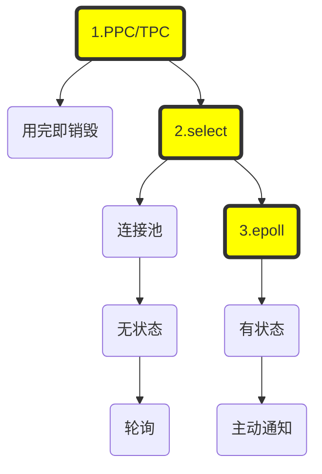

**阻塞IO**：无论使用PPC还是TPC都存在一个问题：针对每一个连接都要创建一个独立的进程（线程）去处理相应的业务逻辑，连接结束后进程（线程）就销毁了，这其实存在很大的资源浪费

**非阻塞IO**：这时一个直接的想法就是引入资源池，典型的是线程池。整个线程池就对应着处理所有的连接，这时就出现了新的问题：如果还是使用阻塞IO的话，一旦线程阻塞，就无法处理其它的连接了，怎么办呢？一个直接的想法就是将阻塞IO，改为非阻塞IO，然后不断的轮询。

当连接数比较大的时候，轮询会不断的浪费、消耗CPU时间。

**IO多路复用**：这个新的想法是，不再轮询所有的连接，而是找到单独一个对象，select对象仍然是阻塞的，但是呢，只阻塞它一个。当有连接上产生r/w/e事件的时候，通知被阻塞唯一的线程，然后再去轮询select关注的那一批连接，找到直接来事件的那一个，然后处理。

如果没有IO事件发生，程序会阻塞在select处，只不过不再每条连接阻塞一个线程，而是只阻塞持有select对象的那一个线程。

select仍然是轮询的，只不过不会无休止地轮询每一个连接，而是等到有某个连接有事件后再轮询。但是，如果关注的连接过多的话，仍然会存在大量的空轮询。

