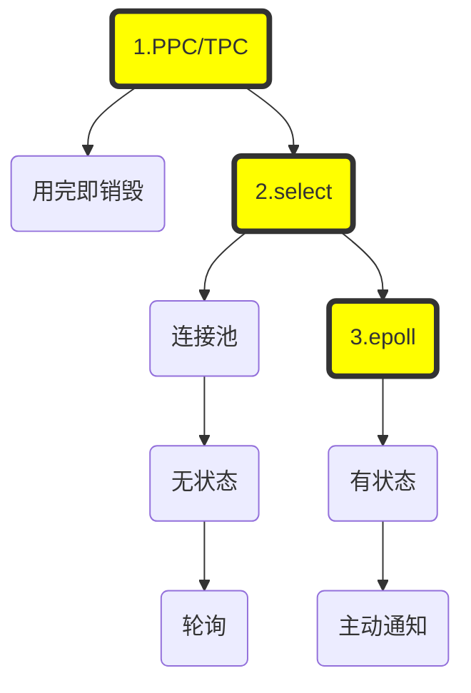

餐厅老板：操作系统

服务员：线程

食客：连接

要做的事：当餐厅来客人时，需要客人接待

**阻塞IO**：餐厅刚开业时，客人少，往往只有几个人。有客人来时，都直接喊老板。老板也只有一个人，接待客人就不能干别的了。时间长了老板觉得不行，堂堂老板是要干大事情的，怎么能天天招待客人。

老板想了想，我招服务员，每一个客人给他配一个服务员，一对一VIP服务，等客人吃完走了了我就把服务员也辞退了。这样所有的事情都由服务员去处理了，老板自己就空闲了。一开始，老板还觉得自己很聪明，客人很满意，VIP服务嘛，而且一个服务员也没多招，客人一离开我就把服务员辞退了。

**非阻塞IO**：没过几天老板就觉得自己很傻逼了，因为频繁的招聘、辞退服务员也太费精力了，要不我们成立一个服务员小组吧，反正一定有新的客人会来，服务员就别辞退了。

过了一段时间，老板觉得自己还是很傻逼，因为VIP服务也太贵了，被一对一服务的那个客人大部分时间是没有需求的，同时会有很多其它客人下单或买单，结果该服务员还腾不出空来去为别的客人服务。

于是，老板就告诉服务员：取消VIP服务，每个服务员同时负责好几桌。有哪个客人有事，就去处理，没事时就不断的去问客人：“请问您需要服务吗？请问您需要服务吗？”

**IO多路复用**：这下，客人基本上满意了，但服务员不干了。本来一对一的时候，服务员是有时间喝茶的，现在搞成轮询制， 那个累啊。因为大部分情况下客人是没有事要处理的。于是服务员自己想了一个办法，说老板能不能这样，我们不用去不断地问客人，咱能不能反过来，让客人需要服务的时候喊一嗓子呗？老板一听对啊，还能省下服务员口渴喝水的人钱，于是说：“就这么干”。

这一下子，处理效率果然大大加强，因为服务员只要客人吆喝就可以了，不用再频繁的去轮客人了，平时闲下来还可以喝喝荼。老板一看，不合算啊，我花钱请服务员来，你无事可做竟然在这里喝茶？于是一甩手，扩大餐厅规模，好嘛，一下子摆了1024个桌子。

这下子，服务员有得忙了。你想，原来几个客人的时候，哪个客人吆喝一声基本上也就知道是谁了，而现在有有1024个桌客人。那可是人山人海啊，有人吆喝一嗓子，但谁特么能听出来到底是哪个客人喊的。没办法，一桌一桌的去问吧， 1024桌啊，轮一遍一上午都过去了。

服务员找到老板，说：老板，这样不行，太累了，你得加钱。

老板掐指一算，心理独白：“加钱？怎么可能啊”，话到嘴边就变成了：“我说小x啊，加钱也不解决问题啊，为了你的身体考虑，你看这样行不行，咱在每个桌子上安装一个呼叫器吧，这样哪桌客人有需求直接按一下就可以了，你们也就知道去服务哪一桌了，你看这样行不行？”。

服务员一看，老板果然还是棋高一招啊，问题果然解决了。

于是，服务员果断辞职。

1. 短期看运营，中期看产品，长期看技术。
2. 我写书，可以先不提技术，把故事讲完了，再提一下技术，甚至不提。

----

**阻塞IO**：无论使用PPC还是TPC都存在一个问题：针对每一个连接都要创建一个独立的进程（线程）去处理相应的业务逻辑，连接结束后进程（线程）就销毁了，这其实存在很大的资源浪费

**非阻塞IO**：这时一个直接的想法就是引入资源池，典型的是线程池。整个线程池就对应着处理所有的连接，这时就出现了新的问题：如果还是使用阻塞IO的话，一旦线程阻塞，就无法处理其它的连接了，怎么办呢？一个直接的想法就是将阻塞IO，改为非阻塞IO，然后不断的轮询。

当连接数比较大的时候，轮询会不断的浪费、消耗CPU时间。

**IO多路复用**：这个新的想法是，不再轮询所有的连接，而是找到单独一个对象，select对象仍然是阻塞的，但是呢，只阻塞它一个。当有连接上产生r/w/e事件的时候，通知被阻塞唯一的线程，然后再去轮询select关注的那一批连接，找到直接来事件的那一个，然后处理。

如果没有IO事件发生，程序会阻塞在select处，只不过不再每条连接阻塞一个线程，而是只阻塞持有select对象的那一个线程。

select仍然是轮询的，只不过不会无休止地轮询每一个连接，而是等到有某个连接有事件后再轮询。但是，如果关注的连接过多的话，仍然会存在大量的空轮询。

