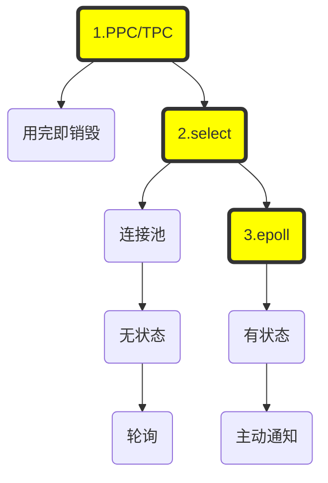

老板：操作系统

秘书处：线程池

连接：员工

要做的事：员工有事情时，要找秘书处理

**阻塞IO**：最开始的时候员工少，只有几个人，员工有事的时候，都是直接来找老板，老板也只有一个人，接待员工就不能干别的了，时间长了老板觉得不行，堂堂老板是要干大事情的，怎么能天天安抚员工了。老板想了想，要不这样吧， 我招秘书，每一个员工给他配一个秘书，一对一VIP服务，员工离职了我就把秘书也辞退了。这样所有的事情都由秘书去处理了，老板自己就空闲了。一开始，老板还觉得自己很聪明，员工很满意，VIP服务嘛，而且一个秘书也没多招，员工一离职我就把秘书辞退了。

**非阻塞IO**：没过几天老板就觉得自己很傻逼了，因为频繁的招聘、辞退秘书这也太费精力了，要不我们成立一个秘书处吧，反正一定有新的员工会来，秘书就别辞退了。

后来老板觉得自己还是很傻逼，因为VIP服务也太贵了，明明被一对一服务的那个员工没有事，同时还有其它员工来找，结果该秘书还腾不出空来去为别的员工服务。于是，老板就告诉秘书处：取消VIP服务。让秘书们去问，有哪个员工有事，就去处理，没事就问下一下，不断的轮询

**IO多路复用**：这下，员工基本上满意了，但秘书不干了。本来一对一服务的时候，秘书是有时间喝茶的，现在搞成轮询制， 那个累啊。因为大部分情况下员工是没有事要处理的。于是秘书自己想了一个办法，大家都是好哥们，说老板能不能这样，我们不去问员工，咱能不能反过来，让员工有事来找我们呗？老板说可以，但是呢，老板扣索儿的，怕员工跟秘书联合起来搞事情，不允许秘书知道员工的信息。说这样，咱给个匿名信箱，员工有事投信箱，然后秘书拿到信之后，再挨个员工去问：你有事嘛？请问你有事嘛？

这一下子，处理效率果然大大加强，因为秘书只要盯信箱就可以了，不用再频繁的去轮员工了，平时还可以喝喝荼。老板一看，那不行啊，我花钱请你来，你无事可做竟然在这里喝茶？我们得招人，招员工。啪，一甩手，招了1024个员工，这下子，一旦秘书拿到匿名信，要去问1024个员工。谁？到底是谁特么有事，就不能告诉我一声嘛？轮一遍一上午都过去，连喝茶的时候都没有了，这也太特么累了。

秘书找到老板，说：老板，这样不行，太累了，你得加钱。

老板掐指一算，心理独白：“加钱？那不行，我宁愿放权，也不能加钱”，话到嘴边，变成了：“我说小秘啊，加钱也不解决问题啊，为了你的身体考虑，你看这样行不行，咱别用匿名信箱了，来个实名的吧，拿到信能让你直接找到哪个员工来处理，你看这样行不行？”。

秘书一看，问题果然解决了，老板果然还是棋高一招啊，于是，秘书果断辞职。

1. 短期看运营，中期看产品，长期看技术。
2. 我写书，可以先不提技术，把故事讲完了，再提一下技术，甚至不提。

----

**阻塞IO**：无论使用PPC还是TPC都存在一个问题：针对每一个连接都要创建一个独立的进程（线程）去处理相应的业务逻辑，连接结束后进程（线程）就销毁了，这其实存在很大的资源浪费

**非阻塞IO**：这时一个直接的想法就是引入资源池，典型的是线程池。整个线程池就对应着处理所有的连接，这时就出现了新的问题：如果还是使用阻塞IO的话，一旦线程阻塞，就无法处理其它的连接了，怎么办呢？一个直接的想法就是将阻塞IO，改为非阻塞IO，然后不断的轮询。

当连接数比较大的时候，轮询会不断的浪费、消耗CPU时间。

**IO多路复用**：这个新的想法是，不再轮询所有的连接，而是找到单独一个对象，select对象仍然是阻塞的，但是呢，只阻塞它一个。当有连接上产生r/w/e事件的时候，通知被阻塞唯一的线程，然后再去轮询select关注的那一批连接，找到直接来事件的那一个，然后处理。

如果没有IO事件发生，程序会阻塞在select处，只不过不再每条连接阻塞一个线程，而是只阻塞持有select对象的那一个线程。

select仍然是轮询的，只不过不会无休止地轮询每一个连接，而是等到有某个连接有事件后再轮询。但是，如果关注的连接过多的话，仍然会存在大量的空轮询。

