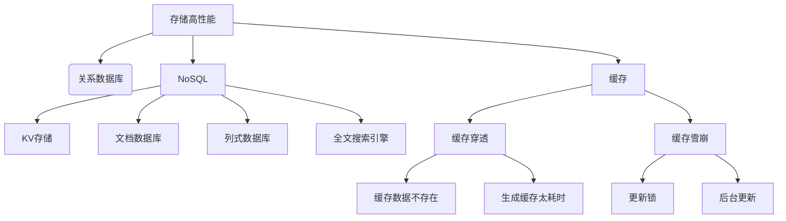

```mermaid
graph TD
Storage[存储高性能] -->RDMS(关系数据库)
Storage --> NoSQL

NoSQL --> KV存储
NoSQL --> 文档数据库
NoSQL --> 列式数据库
NoSQL --> 全文搜索引擎

Storage --> cache[缓存]

cache --> 缓存穿透
缓存穿透 --> 缓存数据不存在
缓存穿透 --> 生成缓存太耗时

cache --> 缓存雪崩
缓存雪崩 --> 更新锁
缓存雪崩 --> 后台更新
```