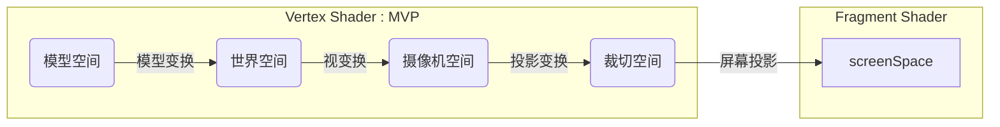

[toc]

#### 01 Abstract



1. 在vertex shader -> tessellate -> geometry shader -> fragment shader -> test&blend 这个流水线中, **vertex shader是始, fragment shader是尾**
2. **vertex shader必须要完成MVP**, 把顶点从model space转到clip space
2. vertex的顶点插值后输出到fragment， 因此在vert中使用float，在frag中使用half。half的速度是float的一倍
2. **ZWrite Off ⇔ 大Queue**.这是因为不写Z Buffer同时Queue太小的话, 容易被遮挡住. Transparent与Outline描边效果都是大Queue的


#### 02 Vertex/Fragment Shader

1. `output.positionCS= UnityObjectToClipPos(input.vertex);` vertex标配MVP
2. `output.normalWS = UnityObjectToWorldNormal(input.normal);` 已标准化
3. unity_AmbientSky天空色(代替UNITY_LIGHTMODEL_AMBIENT), unity_AmbientEquator赤道色, unity_AmbientGround地表色


```glsl
CGPROGRAM
  #pragma vertex vert
  #pragma fragment frag
  #include "UnityCG.cginc"
  
  half4		_Color;
	sampler2D _MainTex;
	float4		_MainTex_ST;

	struct appdata
  {
    float4 vertex		: POSITION;
    float3 normal		: NORMAL;
    float2 texcoord	: TEXCOORD0;
    
    
    float4 tangent	: TANGENT;
    float2 texcoord1: TEXCOORD1;
    UNITY_VERTEX_INPUT_INSTANCE_ID
  }

  struct v2f
  {
    float4 position		: SV_POSITION;
    float3 worldNormal: NORMAL;
    float2 texcoord		: TEXCOORD0;
    SHADOW_COORDS(2)	// 保存阴影坐标
  };
  
  v2f vert(appdata v) 
  {
    v2f o;
    // 物体本身属性相关的计算都是UnityObjectToXXX()系列方法
    // UnityObjectToClipPos		UNITY_MATRIX_MVP
    // UnityObjectToViewPos		UNITY_MATRIX_MV
    // UnityWorldToViewPos		UNITY_MATRIX_V
    // UnityWorldToClipPos		UNITY_MATRIX_VP
    // UnityViewToClipPos			UNITY_MATRIX_P
    o.position					= UnityObjectToClipPos(v.vertex); 			// position = mul(UNITY_MATRIX_MVP, v.vertex);
    o.worldNormal 			= UnityObjectToWorldNormal(v.normal);		// 已标准化
    float3 worldPos 		= UnityObjectToWorldPos(v.vertex);			// worldPos = mul(unity_ObjectToWorld, v.vertex)
    float3 worldTangent = UnityObjectToWorldDir(v.tangent.xyz);	// 已标准化

    
    // 而跟物体本身属性无关的计算, 都是UnityWorldSpaceXXX()系列方法, 包括view和light, 简称:眼光
    float3 lightDir	= normalize(UnityWorldSpaceLightDir(v.vertex));	// 未标准化
   	float3 viewDir	= normalize(UnityWorldSpaceViewDir(v.vertex));	// 未标准化 viewDir=worldPos.xyz - _WorldSpaceCameraPos;

    o.texcoord = TRANSFORM_TEX(v.texcoord, _MainTex);
    TRANSFER_SHADOW(o)	// 变换阴影坐标
  }
  
	half4 frag(v2f i): SV_TARGET
  {
  	UNITY_LIGHT_ATTENUATION(shadowmask, i, worldPos.rgb)	// 计算阴影系数
  
  	half4 color = tex2D(_MainTex, i.texcoord) * _Color;
  	return color;
	}

ENDCG
```


#### 04 Amplify Shader Editor [ASE]

1. 淘宝可买
2. node之间的连线如果是3根则代表着是两边的数值是vector3
3. append节点就是golang里的append, 用于生成slice的


##### 1 快捷键

1. 点击ASE编辑器右上角的Information图标, 打开Helper, 其中有: Editor, Menu, Nodes等各类Shortcuts
2. 选中node, 点F1可以打开帮助文档
3. Commentary (C), 可以起到group分组的作用
4. Integer (0), Float (1),  Vector2 (2), Vector3 (3), Vector4 (4), Color (5)
5. Cross (X), Dot (Period)
6. Add (A), Substract (S), Multiply (M), Divide (D)
7. Texture Sample (T for Texture), Texture Coordinates (U for uv)


##### 2 TextureSample[T]

1. 通常TextureSample都有默认值和乘参
2. 如果同一个shader中出现多个TextureSample, 它们的UV前面可能是同一个TextureCoordinate
3. NoScaleOffset可隐藏纹理的Tilling和Offset, 使用户在面板中不可调节, 基本上纹理都会打开这个


| 类型                              | 默认值 | 乘参                                                         |
| --------------------------------- | ------ | ------------------------------------------------------------ |
| Albedo反射率/反照率               | white  | 乘以Albedo Color [white]调节纹理颜色, white x white = white  |
| Normal法线                        | bump   | 1. 乘以Bumpiness [-2, 2]调节法线强度, 默认值1不改变原始法线<br />2. 需打开UnpackNormalMap, node上会出现Scale连接点 |
| Emission自发光                    | black  | 1. 乘以Emession Color [black]以调节自发光强度, black x black = black<br />2. 自发光可以很耀眼, 因此需要打开HDR, 以使color的范围可以超出[0, 1] |
| Specular镜面光                    | white  | 1. 纹理的RGB通道是镜面光, Alpha通道是Smoothness<br />2. 所以Specular的乘参由两部分组成: 一是Specular Color, 调节镜面光; 二是Smoothness, 调节光滑度<br />3. 默认值black |
| Ambient Occlusion<br />环境光遮挡 | white  | 1. 纹理默认是white, 所以不填texture时完全接受照明<br />2. 填写texture后, 默认只使用texture<br />3. 通过Ambient参数调节ambient与texture的接受程度 |


----

#### 09 References

1. [Unity ShaderLab 新手宝典](https://github.com/FaithTong/UnityShaderLabTutorial)
2. 