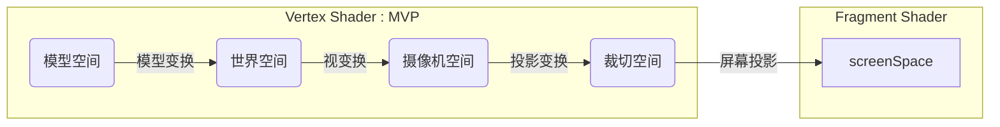

#### 01 Abstract



1. 在vertex shader -> tessellate -> geometry shader -> fragment shader -> test&blend 这个流水线中, **vertex shader是始, fragment shader是尾**
2. **vertex shader必须要完成MVP**, 把顶点从model space转到clip space
2. vertex的顶点插值后输出到fragment， 因此在vertex中使用float，在fragment中使用half。half的速度是float的一倍。


#### 02 Vertex/Fragment Shader


#### 03 [Surface Shader](https://docs.unity3d.com/Manual/SL-SurfaceShaders.html)

1. vertex需要使用UnityObjectToClipPos, 基于MVP矩阵投影到齐次坐标系, 因为vertex是需要裁剪和显示的
2. 但normal与viewDir不需要, 它们只需要在world空间中辅助计算夹角, 光照等信息, 因此只需要UnityObjectToWorldNormal类的方法, 将法线从model空间转到world空间即可 


```glsl
CGPROGRAM
  
	#pragma surface surf StandardSpecular fullforwardshadows
  
  // 凡是放到struct里面的, 无论是Input还是v2f, 都是跟register绑定的, 都是GPU给出的
	// Input中的内容除了uv坐标外, 还包括: 一颜色,二位置,三方向
	struct Input
  {
    float2 uv_Albedo;
    fixed4 color;			// 一个颜色 fixed4 color: COLOR;
    float3 worldPos;	// 二个位置
    float4 screenPos;
    float3 viewDir;		// 三个方向
    float3 worldNormal;
    float3 worldRefl;
  };

  // Properties, 这些属性都是material给出的, 是user输入 
  sampler2D _Albedo;
  sampler2D _Normal;
  sampler2D _AO;

  // SurfaceOutputStandard, 有几个值: ONE SOA
  // O -> albedO 			: albedo与alpha是一对, 加起来恰好是一个float4, 因此albedo是rgb
  // N -> Normal			: tangent空间法线
  // E -> Emission		: 自发光
  // S -> Smoothness	: 0=rough, 1=smooth
  // O -> Occlusion		: 遮挡
  // A -> Alpha				: 透明度
  void surf (Input IN, inout SurfaceOutputStandardSpecular o)
  {
    fixed4 c = tex2D (_Albedo, IN.uv_Albedo);
    o.Albedo = c.rgb;

    fixed4 specular = tex2D (_Specular, IN.uv_Albedo);
    o.Specular = specular.rgb;
    o.Smoothness = specular.a;

    o.Normal = UnpackNormal(tex2D (_Normal, IN.uv_Albedo));
    o.Occlusion = tex2D (_AO, IN.uv_Albedo);
  }

ENDCG

```


#### 04 Amplify Shader Editor [ASE]

1. 淘宝可买
2. node之间的连线如果是3根则代表着是两边的数值是vector3
3. append节点就是golang里的append, 用于生成slice的


##### 1 快捷键

1. 点击ASE编辑器右上角的Information图标, 打开Helper, 其中有: Editor, Menu, Nodes等各类Shortcuts
2. 选中node, 点F1可以打开帮助文档
3. Commentary (C), 可以起到group分组的作用
4. Integer (0), Float (1),  Vector2 (2), Vector3 (3), Vector4 (4), Color (5)
5. Cross (X), Dot (Period)
6. Add (A), Substract (S), Multiply (M), Divide (D)
7. Texture Sample (T for Texture), Texture Coordinates (U for uv)


##### 2 TextureSample[T]

1. 通常TextureSample都有默认值和乘参
2. 如果同一个shader中出现多个TextureSample, 它们的UV前面可能是同一个TextureCoordinate
3. NoScaleOffset可隐藏纹理的Tilling和Offset, 使用户在面板中不可调节, 基本上纹理都会打开这个


| 类型                              | 默认值 | 乘参                                                         |
| --------------------------------- | ------ | ------------------------------------------------------------ |
| Albedo返照率                      | white  | 乘以Albedo Color [white]调节纹理颜色, white x white = white  |
| Normal法线                        | bump   | 1. 乘以Bumpiness [-2, 2]调节法线强度, 默认值1不改变原始法线<br />2. 需打开UnpackNormalMap, node上会出现Scale连接点 |
| Emission自发光                    | black  | 1. 乘以Emession Color [black]以调节自发光强度, black x black = black<br />2. 自发光可以很耀眼, 因此需要打开HDR, 以使color的范围可以超出[0, 1] |
| Specular镜面光                    | white  | 1. 纹理的RGB通道是镜面光, Alpha通道是Smoothness<br />2. 所以Specular的乘参由两部分组成: 一是Specular Color, 调节镜面光; 二是Smoothness, 调节光滑度<br />3. 默认值black |
| Ambient Occlusion<br />环境光遮挡 | white  | 1. 纹理默认是white, 所以不填texture时完全接受照明<br />2. 填写texture后, 默认只使用texture<br />3. 通过Ambient参数调节ambient与texture的接受程度 |


----

#### 09 References

1. [Unity ShaderLab 新手宝典](https://github.com/FaithTong/UnityShaderLabTutorial)
2. 